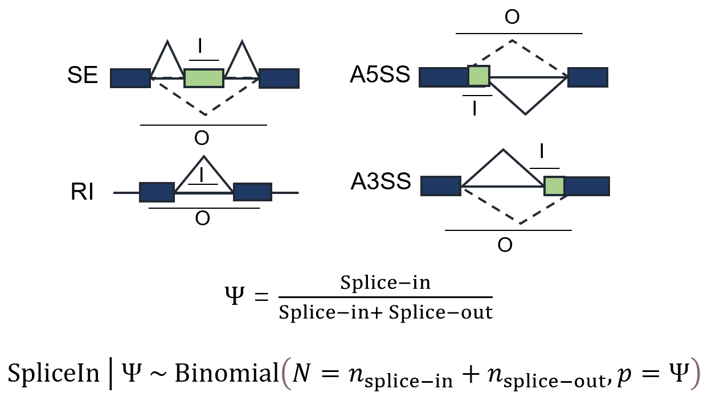

## What is Paean
Paean is designed for transcriptome quantification, especially for gene expression and alternative splicing profiling. Paean is written for CPU-GPU heterogeneous computing. It accelerates the analysis procedure by 100x. We provided three versions of Paean. The first is the CPU-GPU heterogeneous version of Paean, which provides the fastest speed. Except the heterogeneous version, we also provide a Pure-CPU version of Paean for the running enviroment without GPU. Thanks to our fast and efficient parallel algorithms, our Pure-CPU Paean is also very fast. Finally, we provide a MPI version of Paean to support the super-computer running environment.

## Usage
### Building Paean from source
Paean can only run on the Linux environment currently. Building Paean from source requires GNU compiler which supports C++ standard >= 11, Cmake >= 3.10 and CUDA >= 9.2. For Pure-CPU version of Paean, CUDA is not required. Additionally, You need to install some dependent libraries including `zlib`, [htslib](https://github.com/samtools/htslib) and [thrust](https://github.com/NVIDIA/thrust). Before build Paean, please put `htslib` to `/usr` or `/usr/local`. For `thrust`, if you don't have CUDA installed, please follows the commands below to include it.

```
git clone --recursive https://github.com/NVIDIA/thrust.git
cd thrust
cp -r thrust /usr/local/include
cp -r dependencies/libcudacxx/include/nv /usr/local/include
```

After that, you can run the following commands in the root directory to build Paean.

```
mkdir build
cd build
cmake ../
make -j
```

After building Paean we can get two executable binary files `prepare` and `paean`. The `prepare` is used to generate `gene.annotation.gff3` file and `length_table.csv` file shown in the `input` directory. Our strategy for determining the gene length is that we choose the length of the longest transcript in the gene. The `paean` is used for transcriptome quantification.

### Prepare
The `prepare` is used for preparing files only once for the quantification. The files include gene annotation file and the gene length file. In the future, we will support generating the alternative splicing event (ASE) annotation files. The usage is shown as follows:
```
./prepare [options...]

Options:
    -g,--gene            FILE     Gene annotation file with GFF3 format, required
    -o,--output          FILE     Which directory you want to write the results to (default: ./)
    -h,--help                     Print help information
```

### Running Paean
The `paean` generates the transcriptome quantification results which consist of two kinds of results, Transcript Per Million(TPM) and Percent Spliced In Index (PSI) respectively. The usage is shown as follows:
```
./paean [options...]

Options:
      -g,--gene            FILE     Gene annotation file with GFF3 format, required
      -l,--length          FILE     Gene length file with csv format, required
      -x,--ase-types       STRING   Alternative splicing types, required
      -y,--ase-files       FILE     ASE files with csv format, required
      -r,--read            FILE     Read file with BAM format, required
      -o,--output          FILE     Which directory you want to write the results to (default: ./)
      -t,--thread          INT      Number of threads to use to parse BAM file (default: 12)
      -a,--read-max-gap    INT      Max allowed gap for two reads of a mate (default: 500000)
      -m,--mode            INT      1 (single-end) or 2 (paired-end) mode
      -s,--strandness      INT      Strand-specific read counting, 1 (stranded) or 2 (reversely stranded)
      -M,--multi-mapping            Count Multi-mapping reads which are detected by 'NH' tag
                                    in the BAM/SAM file. All reported alignments will be counted
                                    for a multi-mapping read
      -p,--primary                  Count primary alignments only
      -h,--help                     Print help information

```

#### Output format
Paean generates two kinds of files for TPM and PSI respectively. It is worth noting that we use the name (denoted as `<prefix>` of input read file as the prefix of the name of output files. In this case, `<prefix>_gene.tsv` records the TPM result, `<prefix>_ase_type.tsv` records PSI result in which `type` represents one of four types of alternative splicing events: SE, A3SS, A5SS and RI events shown in Figure 1. Besides, Paean generates a plain text file `<prefix>_log.txt` to show some extra information such as time consumption.

<figure>
  
  <figcaption>Figure 1: Four types of alternative splicing events: SE, A3SS, A5SS and RI. The two formulas are for the calculation of PSI and its Confidence Interval respectively.</figcaption>
</figure>

### Example
We provide default files (gene annotation file and splicing event files) for the user to run Paean. With a bam file you can run Paean in the directory where generated binary file is located as follows:

```
./paean -g ../input/gene.annotation.gff3 -l ../input/length_table.csv -r some.bam -x SE,A3SS -y ../input/csv/SE.annotation.csv,../input/csv/A3SS.annotation.csv -o ./ -t 8 -m 2
```
Make sure the chromosome naming in BAM file is consistent with that in GFF and CSV file. For example, the chromosome naming in gene annotation file downloaded from Ensembl has no `chr` prefix, so you need to make sure the chromosome naming in BAM file has no `chr` prefix correspondingly.

### Multi-GPU
Paean shallowly supports Multi-GPU. To use this feature, you can set environment variable GPUS to specify the devices you want to run on. For example, to use the first three GPUs in your computer you can set GPUS=0,1,2. We will better support Multi-GPU in the future.

### Test data
We also provided the [test data and results](https://github.com/Bio-Acc/Paean-Testdata) used in the benchmark of Paean.

### Contact
If you have any question, please contact <guanjw@shanghaitech.edu.cn>.
